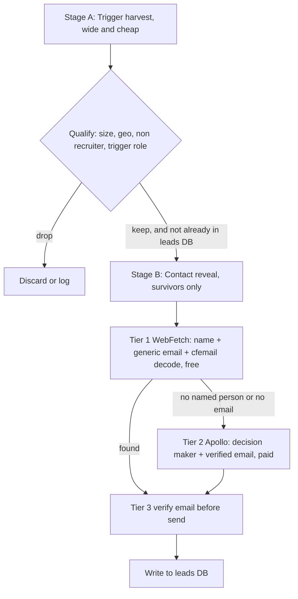

# Amatec Email Outreach Engine — Build Plan

Global English, email first outreach engine for Amatec the automation agency. Reuses the bones of the Jobdrive Lead Radar (n8n async orchestration, Apify actors, two pass enrichment, Postgres store, yield loop) and swaps the India and phone specific parts for a global, email native flow.

Decisions locked with Anirban on 2026-07-15:
Target is Amatec (automation agency). Source is hybrid (job board or web signal plus Apollo for the contact and email). Sender is Mystrika. Storage reuses the shared-postgres `leads` DB.

Refinements from Anirban on 2026-07-15:
1. Split the skill by brand. One thin skill per brand (Amatec and Jobdrive), each owning only its ICP and query set, both calling the same tools and the same `leads` DB. Independent control of what each brand scrapes with zero duplicated plumbing.
2. Same tools, same database, isolated by a `brand` stamp.
3. The job post is the signal, never the target. The HR or recruiter who posted the job feels the pain of filling a seat, not the operational pain, and cannot approve a spend. Use the posting as a company level trigger, then pivot to the real economic buyer by title.
4. Naukri stays a Jobdrive and India tool. For Amatec global English the signal source is LinkedIn (jobs plus post search) and Apollo org search, both global.

---

## 1. What we keep and what we swap

| Pillar | Jobdrive Radar (today) | Amatec Email Engine (new) |
|---|---|---|
| Orchestration | n8n async trio (start_actor, get_run_status, get_dataset_items) | Keep as is |
| Cost pattern | Two pass: cheap search then enrich survivors only | Keep the discipline, apply to Apollo credits |
| Primary source | Naukri (India only) | Apollo org search + global boards (Indeed, LinkedIn) |
| Size gate | get_company_size (EPFO, India) | Apollo `estimated_num_employees` (global, free in result) |
| Contact | Company generic email | Named decision maker plus verified work email |
| Store | Postgres `leads` DB | Same DB, new brand and outreach columns |
| Execution | Telecaller Cockpit (dialing) | Mystrika campaigns (email) |
| Feedback | log_run + get_query_yield | Same loop, plus Mystrika stats into Marketing Analytics |

---

## 2. ICP and trigger definition (Amatec)

Who we want: small and mid operating companies, 1 to 500 employees, in English speaking geographies (US, UK, Canada, Australia, Ireland, New Zealand, plus English first teams anywhere), that just showed a live automation or ops pain.

The trigger (the pain went live now): the company posted one of these roles in the last 30 days.
Operations manager, operations coordinator, RevOps, sales operations, CRM administrator, Zoho or HubSpot or Salesforce admin, data entry, office manager, executive assistant with ops scope.

Keep, boost, drop:

| Rule | Logic |
|---|---|
| Keep | 1 to 500 employees, operating company, English geo, trigger role posted in last 30 days |
| Boost score | Multiple ops roles open, recently adopted a CRM (Apollo tech signal), headcount growth, funding in last 6 months |
| Drop | Over 500 employees, recruiters and staffing (SIC 7361, 7363, 7375; NAICS 5613), nonprofits, associations, government, anything already in `leads` or on the suppression list |

Note from the live Apollo test on 2026-07-14: a raw "currently hiring for X" search is about 90 percent staffing agencies. The recruiter exclusion is mandatory, not optional. It cut 4,487 down to 3,511 real companies and cleaned page one almost entirely.

---

## 3. Scraping (two stage, spend only on survivors)

Stage A, trigger harvest (wide, cheap). Runs in n8n, two feeds merged and deduped:
1. Apollo Organization Search with the job postings filter, last 30 days, 1 to 500 employees, English geos, recruiter SIC and NAICS excluded. About 1 credit per page of 100 companies. This is the spine.
2. Apify global boards for breadth Apollo misses. For Amatec global English the board is LinkedIn (jobs plus post search via harvestapi), plus Indeed global. Naukri is NOT used here, it is India only and stays a Jobdrive tool. LinkedIn post search often carries a role and sometimes a direct email in the post body, but treat it only as a company trigger, contact still comes from Stage B. Cheap pass, no detail fetch.

Merge both, dedup against the `leads` DB so we never re harvest a company we already hold, then apply the keep and drop gate above.

Stage B, contact reveal (targeted, survivors only). The job post told us the company has the pain. It did NOT tell us who to email. The person who posted the role is HR or a recruiter filling a seat, not the one who feels the operational bleeding and not the one who approves a spend. So we discard the poster and target the economic buyer by title, scaled to company size:

| Company size | Target the buyer | Ignore |
|---|---|---|
| 1 to 50 | Founder, owner, CEO | The HR or recruiter who posted |
| 51 to 200 | COO, head of operations, operations director | Same |
| 201 to 500 | Head of RevOps, operations or sales ops lead | Same |

Enrichment cascade, WebFetch first, API only on survivors (decided 2026-07-15). Apply the two pass cost discipline to enrichment itself. WebFetch does the free heavy lifting, the paid API only fills the gap, and every address is verified before it is ever emailed.

| Tier | Tool | Cost | When |
|---|---|---|---|
| 1 | WebFetch the site: decision maker name from About or Team page, generic ops@ or info@, decode Cloudflare cfemail, Chrome fallback for JS rendered pages | Free | Every survivor company first |
| 2 | Apollo People Search inside the org (`organization_ids`) filtered to the title ladder plus seniority (owner, c_suite, vp, head, director), then enrich for the verified work email | Paid, per credit | Only when tier 1 has no named person or no verified email |
| 3 | Email verification (NeverBounce, MillionVerifier, about $0.001 each) | Tiny | On every address from tier 1 or tier 2, before send. Non negotiable |

Why not WebFetch only. Cold email lives or dies on deliverability. WebFetch hands back a raw email string it cannot verify, and sending to guessed or dead addresses causes bounces, bounces trigger spam flags, and a few bad batches can burn the sending domain for good. WebFetch also mostly yields generic info@ inboxes, which pull far lower reply rates than a named person. So WebFetch is the default source to keep spend near zero, but the tier 2 verified fallback and the tier 3 verification step are what make it safe. The HR poster is a last resort fallback, never the primary target.

This mirrors the proven Jobdrive two pass: a cheap wide pass then paid enrichment only on the rows that survive the gate, so credits and Apify spend track qualified companies, not raw volume.

Gotcha to design around: the Apollo MCP reveal and enrich tools carry a mandatory in turn human confirmation and cannot run fully unattended (verified in memory.md). Two clean options: run Stage B as an attended weekly pass, or move the reveal to a direct Apollo API call inside n8n to bypass the MCP guard. Recommend the direct API call in n8n for a hands off pipeline.

Data source evaluated and parked, ZoomInfo (2026-07-15). ZoomInfo has a working MCP connector and strong global data, but it is an enterprise tool. Entry plans start around $14,995/year on annual contract only, the API tier a scraper needs starts around $50,000/year, seats carry a 3 seat minimum, and the median real contract runs about $31,875/year (Vendr, 1,313 buyers). Against Amatec's current run rate and runway that is irrational, and Apollo already delivers global, email native, self serve, no contract data. Decision: do not use ZoomInfo now. If Apollo coverage ever disappoints, test Lusha, Clay, or Explorium Vibe Prospecting as a secondary Stage B reveal source first, all credit based and self serve, all far cheaper than ZoomInfo. Revisit ZoomInfo only if an enterprise sales budget appears.

---

## 4. Storing (reuse the Postgres leads DB, isolate the pipeline)

Reuse the `leads` table, but keep the email engine rows cleanly separated from the Jobdrive and telecaller rows so the two pipelines never collide.

Isolation:
- Add a `brand` column and stamp `brand='amatec'` (Jobdrive rows stay `brand='jobdrive'`), or use `origin='amatec_email'`.
- Do NOT overload the telecaller `status` column. It is guarded by `leads_status_chk` (the constraint that already broke the Registered outcome once). Add a separate `outreach_status` column with its own CHECK so the email pipeline and the calling pipeline evolve independently.

New columns for email outreach:

| Column | Purpose |
|---|---|
| brand | 'amatec' vs 'jobdrive', hard isolation |
| decision_maker_name, decision_maker_title | Named contact from Apollo |
| contact_email | Verified work email |
| email_status | verified, generic, none |
| trigger_type | The role that fired (ops manager, CRM admin, etc) |
| trigger_detail | Exact job title plus posted date, used for personalization |
| lead_source | apollo, indeed, linkedin |
| enrichment_source | apollo, webfetch, manual |
| outreach_status | new, queued, sent, opened, replied, bounced, unsub, won, lost (own CHECK) |
| mystrika_campaign | Which campaign the lead sits in |
| last_email_at | Timestamp of last send |

Dedup and suppression:
- Dedup key is company domain plus email. One company, one active thread.
- A global `suppression` list for unsub and hard bounce. Nothing on suppression is ever re harvested or re sent. This is also the compliance backbone (see section 6).

Yield logging: keep the radar_runs style per run log (`log_run`) so `get_query_yield` can tell you which trigger role, geo, and source actually convert to replies, then kill weak slices next run.

---

## 5. Execution (Mystrika)

Flow: n8n pushes qualified, email verified leads into Mystrika via its API or import, one campaign per ICP slice (for example "Amatec Ops trigger US", "Amatec CRM admin UK").

Message track (copy owned by maven): the "before you hire" angle proven in the trigger work. Three step sequence.
1. Email 1, trigger personalized. References the exact role they just posted. "Saw you are hiring a [role]. Before you add headcount for it, here is what we automated for a company like yours."
2. Email 2, proof. A similar company case and the outcome.
3. Email 3, soft breakup.

Personalization pulls from the stored `trigger_detail`, `decision_maker_name`, and company. Verified emails send on the main track. Generic emails go to a separate low volume track or a manual review queue, never the same blast.

Deliverability guardrails (standard cold email hygiene):
- Send from a secondary domain with warmed inboxes, not the primary amatec.in mailbox.
- Ramp volume slowly, respect per inbox daily caps.
- Handle unsubscribe and bounce, write both straight back to the suppression list.

Feedback loop:
- Mystrika daily stats already flow into the Marketing Analytics project (`email_stats`). Reuse it, do not rebuild it.
- A positive reply creates the deal or hands to Anirban. Open and reply write back to `outreach_status` on the lead row so the yield loop can score which trigger, geo, and copy actually book calls.

---

## 6. Compliance and deliverability (read before first send)

Cold email to businesses is workable but rule bound, and the rules differ by country. This is legal adjacent, so confirm the specifics with a professional before scaling. Plain English summary:
- US, Canada, Australia, UK: B2B cold email is generally permitted with a clear unsubscribe, a real physical postal address, honest headers, and prompt honoring of opt outs (CAN-SPAM, CASL, the UK PECR business exemption).
- EU: GDPR and PECR are stricter on unsolicited email. Safer to lead with US, CA, AU, UK first and treat EU carefully or hold it back until the basis is confirmed.
- Practical rule: verified unsubscribe on every send, suppression enforced globally, secondary sending domain, and never buy or blast unverified lists.

Anirban should confirm the country approach with counsel. The engine is built to honor opt outs and suppression by design, which is the foundation either way.

---

## 7. Cadence and rollout

| Phase | What | Gate before next |
|---|---|---|
| 0. Schema | Add brand, outreach columns, outreach_status CHECK, suppression to `leads` | Applied and confirmed on shared-postgres |
| 1. Scrape | Wire Stage A plus Stage B in n8n, one manual run, review the qualified list | List is clean (recruiters and enterprises gone), emails verified |
| 2. Store | Land the run into `leads` with brand='amatec', dedup working | No collision with Jobdrive rows, dedup holds |
| 3. Send, pilot | Push 20 to 50 verified leads into one Mystrika campaign, attended | Deliverability healthy, replies come in, suppression writes back |
| 4. Automate | Schedule a weekly n8n run, load Mystrika, log yield | Reply rate beats a cold baseline, then scale volume and geos |

Keep a human approval gate before each send batch until deliverability and copy are proven. After that, the weekly run refills and sends on its own, with the yield loop tuning which slices to push.

---

## 8. Open items for Anirban

1. Confirm the sending domain and inbox setup for Mystrika (secondary domain recommended, not primary amatec.in).
2. Confirm the country approach for compliance (recommend US, CA, AU, UK first).
3. Decide Stage B reveal path: attended weekly Apollo pass, or direct Apollo API call in n8n for hands off. Recommend the API call.
4. This plan can become the BUILD REQUEST to Antigravity in CLAUDE.md once the four items above are set.
