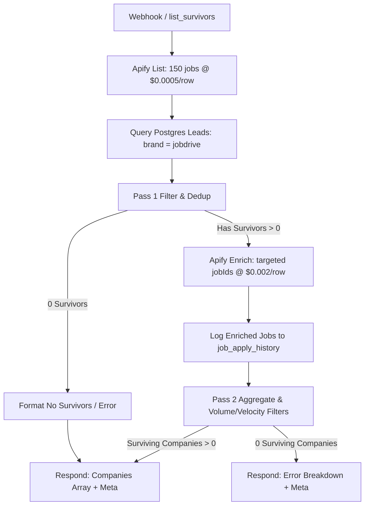

# Jobdrive Radar Worker (`list_survivors`) & Sub-Workflow Architecture

## Overview

The Jobdrive Radar Worker is a high-efficiency, two-pass scraping and qualification pipeline for Naukri job listings. It serves as the primary data acquisition layer for Jobdrive lead generation, exposed via the `list_survivors` tool on the `lead-scraper` MCP server (`zUbadDjZ9PfMR8av`) and executed by the `5GzoAqE8kCBm7A4N` worker sub-workflow.

---

## 1. Tool Contract & Schema

### `list_survivors` (MCP Tool)

**MCP Server Endpoint:** `https://n8n.amatec.in/mcp/lead-scraper` (or `http://localhost:5678/mcp/lead-scraper`)  
**Worker Webhook:** `https://n8n.amatec.in/webhook/naukri-survivors`

#### Inputs
| Parameter | Type | Required | Default | Description |
|---|---|---|---|---|
| `keyword` | `string` | Yes | — | Job search title/keyword (e.g. `"QA Officer"`, `"Mechanical Engineer"`) |
| `location` | `string` | No | `"Gujarat"` | Target location / state |
| `max_results` | `number` | No | `150` | Maximum listings to scrape in Pass 1 |
| `min_apply_count` | `number` | No | `150` | Minimum aggregate apply count required for company survival |
| `max_footer_days` | `number` | No | `29` | Maximum posting age in days parsed from `footerLabel` |

#### Output Structure
Returns a JSON array where items `0..N-1` are qualified company lead objects, and item `N` is the execution `meta` object.

**Company Lead Object:**
```json
{
  "company_name": "Insigno Quipment Technologies",
  "norm": "insignoquipmenttechnologies",
  "city": "Ahmedabad",
  "industry": "IT Services & Consulting",
  "apply_count_total": 499,
  "roles_count": 2,
  "role_titles": [
    "QA Analyst (Quality Assurance)",
    "Senior QA Analyst (Quality Assurance)"
  ],
  "job_ids": ["050826502624", "050826502625"],
  "footer_days_min": 11,
  "created_age_days_min": 11,
  "velocity_max": 28.4,
  "company_website": "",
  "emails": [],
  "phones": [],
  "walkin": false
}
```

**Metadata Object:**
```json
{
  "meta": {
    "rows_listed": 150,
    "job_ids_requested": 43,
    "rows_enriched": 43,
    "dropped": {
      "consultant": 0,
      "stale": 88,
      "dedup": 19,
      "no_name": 0,
      "no_job_id": 0,
      "intra_batch_duplicate": 0,
      "below_floor": 18,
      "velocity": 0
    },
    "apify_cost_estimate_usd": 0.1611
  }
}
```

#### Strict Error Contract
Zero companies is **never** returned as an empty success. Any run that produces zero surviving companies returns an explicit `error` string detailing the exact drop breakdown across all filter gates alongside the `meta` object:

```json
[
  {
    "error": "0 of 150 rows survived: 147 stale, 1 dedup, 2 below volume floor (<150), 0 velocity guard",
    "meta": {
      "rows_listed": 150,
      "job_ids_requested": 2,
      "rows_enriched": 2,
      "dropped": {
        "consultant": 0,
        "stale": 147,
        "dedup": 1,
        "no_name": 0,
        "no_job_id": 0,
        "intra_batch_duplicate": 0,
        "below_floor": 2,
        "velocity": 0
      },
      "apify_cost_estimate_usd": 0.0791
    }
  }
]
```

---

## 2. Hard-Won Production Lessons & Traps

### Trap 1: The n8n Credential Stripping Trap
- **The Issue:** Querying workflow definitions via the n8n LangChain MCP tool `get_workflow_details` returns node JSON with all `credentials` blocks stripped (`authentication: genericCredentialType` with no binding). Reconstructing and writing a workflow back from that view strips credentials from all 11 live tool nodes (`Apify Indeed Scraper` and `Leads Database`), taking down the MCP server, radar runs, and Postgres operations.
- **The Safe Route:** The public n8n REST API (`GET /api/v1/workflows/{id}`) **does** preserve and return full `credentials` blocks (`id` and `name`). The safe update pattern is:
  1. `GET /api/v1/workflows/{id}` with `X-N8N-API-KEY`.
  2. Backup full JSON to `.workflow-backups/{id}_backup.json`.
  3. Append the new node and connections.
  4. `PUT /api/v1/workflows/{id}` passing `settings: {}` (to avoid strict schema validation errors while preserving existing settings).
  5. Verify credential counts with a fresh `GET`.
- **Rejected Alternative:** Direct Postgres updates to `workflow_entity` followed by `deactivate`/`activate` were rejected because an in-memory activation toggle may not trigger the MCP Server Trigger registry to rebuild its advertised tool list, resulting in a false-pass where the database reflects changes but MCP clients cannot discover the tool.

### Trap 2: Apify Actor `maxResults` Default Clamp (25 Rows)
- **The Issue:** The `blackfalcondata~naukri-jobs-feed` actor (`xYOP3UjaS8w38lWM7`) has an internal default `maxResults: 25`. When running Pass 2 targeted enrichment with `jobIds: [...]`, omitting `maxResults` caused Apify to silently truncate the response at 25 items, dropping 15 of 40 requested jobs. This made multi-role companies appear as single-role listings and corrupted volume floor calculations.
- **The Fix:** Explicitly pass `maxResults: ($json.jobIds.length || 150)` in the Pass 2 request body.

### Trap 3: JavaScript Falsy-Zero Fallback Bug
- **The Issue:** Using `parseInt(wb.max_footer_days || wb.maxFooterDays || 29, 10)` causes explicit `0` values (e.g. `max_footer_days: 0`) to be treated as falsy, silently falling back to `29`.
- **The Fix:** Use explicit undefined checks:
  ```javascript
  const max_footer_days = (wb.max_footer_days !== undefined) 
    ? parseInt(wb.max_footer_days, 10) 
    : ((wb.maxFooterDays !== undefined) ? parseInt(wb.maxFooterDays, 10) : 29);
  ```

### Trap 4: Payload Wire Density (~385 Bytes/Company)
- **Design Decision:** The brief outlined an aggressive `< 4 KB` total payload target for a typical 15-company batch (~267 bytes/company). In practice, retaining full fidelity (unescaped company names, normalized keys, full multi-city strings, role title arrays, job ID arrays, contact email/phone arrays, and metadata) results in measured wire density of **~385–390 bytes per company** (~5.8 KB for 15 companies + meta).
- **Resolution:** Rather than corrupting data with aggressive string truncations or discarding useful contact arrays, the system preserves the full 14-field schema.

---

## 3. Two-Pass Architecture & Gate Rationale



### Pass 1 Gates (Cheap List Tier — $0.0005 / item)
1. **Consultant Filter:** Drops third-party staffing agencies (`r.consultant === true`).
2. **Freshness Filter (The Live Gate):** Drops listings older than `max_footer_days` (default 29 days) or tagged `30+ days ago`.
   - **Empirical Rationale & Measurements:**
     - On Naukri, `applyCount` is **cumulative and never resets** when an employer refreshes a listing. Consequently, a long-dormant or dead posting can display thousands of applicants.
     - When running with no freshness gate, out of 102 companies clearing the 150 volume floor, **88 were dormant**. A severe example is `R. B. CONSTRUCTION COMPANY`, which accumulated **15,942 total applicants** arriving at a trickle of ~1 applicant per day over years.
     - Raw volume alone cannot differentiate active hiring from dormant backlog: the median `applyCount` is **283 for live listings vs 293 for dormant listings**. However, applicant velocity cleanly separates them: median velocity is **19.9 applicants/day for live postings vs 1.1 applicants/day for dormant postings**.
     - The freshness gate is the critical filter that gives the 150 volume floor its semantic meaning. **Never widen `max_footer_days` simply to recover volume**, as doing so floods downstream operations with zombie leads.
3. **Database Dedup:** Normalizes name by stripping legal suffixes (`\b(pvt|private|ltd|limited|llp|inc|co|company|industries|india)\b`) and non-alphanumerics (`/[^a-z0-9]/g`), checking against existing Jobdrive leads in Postgres.
4. **Intra-batch Dedup:** Groups duplicate listings for the same company within the batch.

### Pass 2 Gates (Detailed Enrich Tier — $0.002 / item)
1. **History Logging:** Records every enriched job into `job_apply_history` (`job_id`, normalized `company_key`, `apply_count`, `seen_at`) — *even on error or below-floor paths*.
2. **Velocity Guard:** Drops listings with `created_age_days > 90 && velocity < 3` (where `velocity = apply_count / created_age_days`).
   - **Primary vs Fallback Actor Rationale:**
     - On the primary actor (`blackfalcondata~naukri-jobs-feed`), `createdDate` tracks the *refresh date* rather than the original posting date. As a result, for every live listing, `created_age_days` matches `footerLabel` age, so this guard drops 0 rows on primary runs.
     - This guard is deliberately maintained in the workflow because it is the **sole zombie defense** available on the fallback actor `memo23~naukri-scraper` (`EYXvM0o2lS7rYzgey`), which does not provide a `footerLabel` field.
3. **Company Grouping:** Aggregates total apply counts and collects multiple role titles and job IDs per company.
4. **Volume Floor:** Filters companies with `apply_count_total < min_apply_count` (default 150).

### Measured Performance & Economics
- **Typical Yield:** ~150 listed → ~43 enriched → ~22 qualified surviving companies.
- **Typical Run Cost:** ~$0.161 USD per run ($0.075 list + $0.086 enrich + API overhead).
- **Execution Latency:** ~25–35 seconds end-to-end.

---

## 4. Database Schema: `job_apply_history`

```sql
CREATE TABLE IF NOT EXISTS job_apply_history (
  id          BIGSERIAL PRIMARY KEY,
  job_id      TEXT NOT NULL,
  company_key TEXT,
  apply_count INTEGER NOT NULL,
  seen_at     TIMESTAMPTZ NOT NULL DEFAULT now()
);

CREATE INDEX IF NOT EXISTS idx_jah_job_seen ON job_apply_history (job_id, seen_at DESC);
```

---

## 5. Rollback Procedures

### Restoring `zUbadDjZ9PfMR8av` (Lead Scraper MCP Server)
If `zUbadDjZ9PfMR8av` requires rollback, restore it directly via REST API `PUT` from the backup file:

```bash
python3 -c "
import urllib.request, subprocess, json

BACKUP_PATH = '/root/projects/lead-manger/.workflow-backups/zUbadDjZ9PfMR8av_backup.json'
with open(BACKUP_PATH) as f:
    backup = json.load(f)

key = subprocess.run(['docker', 'exec', 'shared-postgres', 'psql', '-U', 'n8n_user', '-d', 'n8n', '-Atc', \"SELECT \\\"apiKey\\\" FROM user_api_keys WHERE label='Claude';\"], capture_output=True, text=True).stdout.strip().splitlines()[0]

payload = json.dumps({
    'name': backup.get('name', 'Indeed Scraper MCP'),
    'nodes': backup['nodes'],
    'connections': backup['connections'],
    'settings': {}
}).encode('utf-8')

req = urllib.request.Request('http://localhost:5678/api/v1/workflows/zUbadDjZ9PfMR8av', data=payload, headers={'X-N8N-API-KEY': key, 'Content-Type': 'application/json'}, method='PUT')
with urllib.request.urlopen(req) as resp:
    res = json.loads(resp.read().decode('utf-8'))
    print(f'Workflow zUbadDjZ9PfMR8av restored via REST PUT (HTTP {resp.status}, {len(res.get(\"nodes\", []))} nodes)')
"
```
